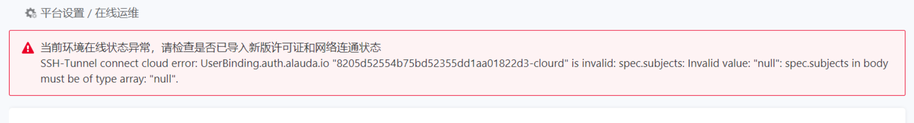

---
kind:
  - Troubleshooting
products:
  - Alauda Container Platform
  - Alauda DevOps
  - Alauda AI
  - Alauda Application Services
  - Alauda Service Mesh
  - Alauda Developer Portal
ProductsVersion:
  - 4.1.0,4.2.x
---
<!-- A type of document that involves encountering a fault, diagnosing it, performing root cause analysis, and providing solutions. -->

# 在线运维状态异常

在线运维状态异常

## Cause
- userbinding crd 中存在多余的 preserveUnknownFields: true 配置

## Resolution
- 删除 userbinding crd 中的 preserveUnknownFields: true 配置项

## [workaround]

## [Related Information]
**Screenshots**

- Environment: 3.10.0
- userbinding crd
- preserveUnknownFields
- Component: 在线运维
- Page ID: 133095362
- Original Title: 在线运维状态异常
