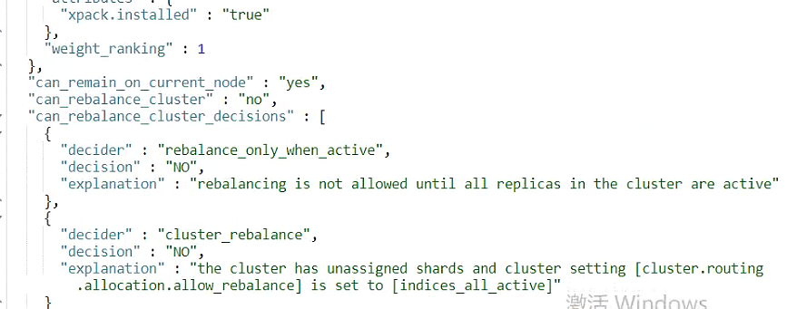

---
kind:
  - Troubleshooting
products:
  - Alauda Container Platform
  - Alauda DevOps
  - Alauda AI
  - Alauda Application Services
  - Alauda Service Mesh
  - Alauda Developer Portal
ProductsVersion:
  - 4.1.0,4.2.x
---
<!-- A type of document that involves encountering a fault, diagnosing it, performing root cause analysis, and providing solutions. -->

# 业务集群单节点es告警

es索引均为yellow状态 集群存在未分配分片(unassigned shards) 告警策略处于告警状态

## Cause
- cluster.routing.allocation.allow_rebalance设置为indices_all_active导致分片无法重新平衡
- 单节点es无法分配副本分片(replica shards)

## Resolution
- PUT /_cluster/settings?pretty&master_timeout=180s
{
  "transient" : {
    "cluster.routing.allocation.allow_rebalance" : "indices_primaries_active"
  }
}
- PUT /_all/_settings
{
    "number_of_replicas": 0
}
- 修改ConfigMap配置防止新建索引产生副本: kubectl get cm -n cpaas-system aiops-logging-config

## [workaround]

## [Related Information]
**Screenshots**

- Environment: 3.10.x 版本业务集群单节点es
- cluster.routing.allocation.allow_rebalance
- number_of_replicas
- _cluster/allocation/explain
- _cluster/health
- _cat/shards
- aiops-logging-config
- Component: (待归类)
- Page ID: 136512915
- Original Title: 业务集群单节点es告警
