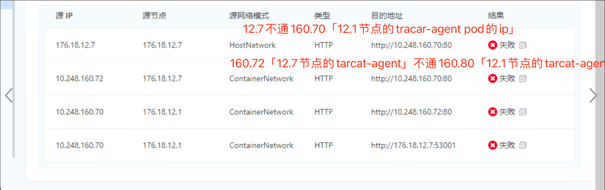
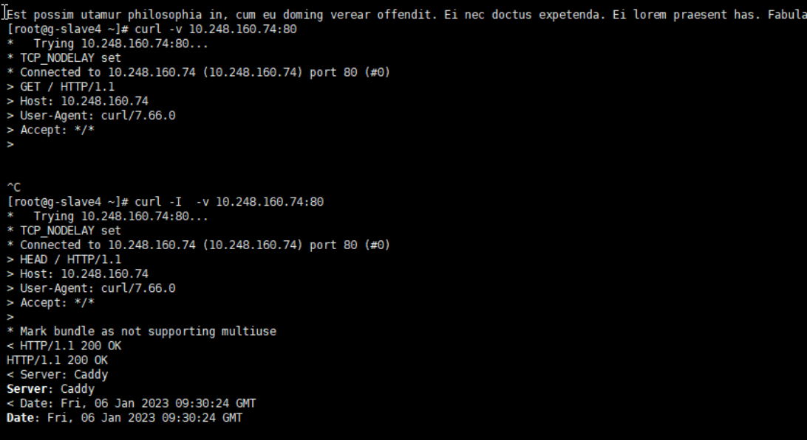
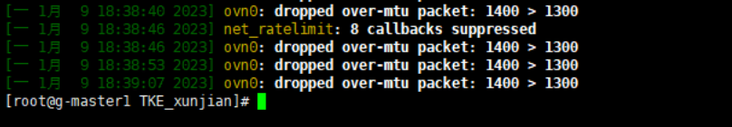
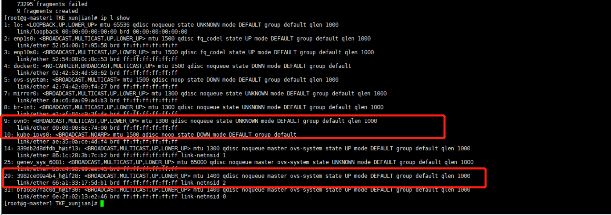

---
kind:
  - Troubleshooting
products:
  - Alauda Container Platform
  - Alauda DevOps
  - Alauda AI
  - Alauda Application Services
  - Alauda Service Mesh
  - Alauda Developer Portal
ProductsVersion:
  - 4.1.0,4.2.x
---
<!-- A type of document that involves encountering a fault, diagnosing it, performing root cause analysis, and providing solutions. -->

# 网络检测部分失败

网络检测部分失败 curl不带-I参数时通讯失败 系统日志存在mtu不一致报错

## Cause
- 物理网卡mtu被从1400修改为1500
- ovn0网卡mtu(1300)与pod mtu(1400)不一致

## Resolution
- 将物理网卡mtu从1500改回1400
- 重启所有被修改过的kube-ovn-cni pod

## [workaround]

## [Related Information]
**Screenshots**
global集群9台节点最初mtu都是1400，后面有人将其中两台节点的mtu修改成1500，

- Environment: Kube-OVN 3.4版本环境
- ovn0
- kube-ovn-cni
- 物理网卡mtu配置
- pod mtu配置
- Component: (待归类)
- Page ID: 136517200
- Original Title: 网络检测部分失败
