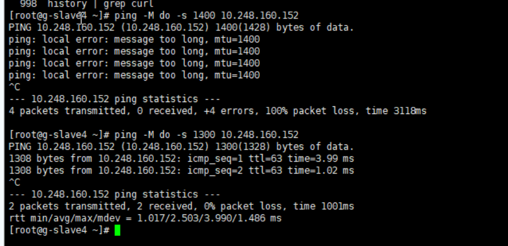

---
kind:
  - Troubleshooting
products:
  - Alauda Container Platform
  - Alauda DevOps
  - Alauda AI
  - Alauda Application Services
  - Alauda Service Mesh
  - Alauda Developer Portal
ProductsVersion:
  - 4.1.0,4.2.x
---
<!-- A type of document that involves encountering a fault, diagnosing it, performing root cause analysis, and providing solutions. -->

# 如何通过ping检测网络中最大mtu值

部分端口或url无法访问

## Cause
- cni的mtu和宿主机网卡mtu不一致导致大包丢弃

## Resolution
- ping -s 1500 ip
- ping -M do -s 32767 -c 4 <ip>

## [workaround]

## [Related Information]
**Screenshots**

- Environment: 通用
- mtu
- cni
- 宿主机网卡
- Component: (待归类)
- Page ID: 136517245
- Original Title: 如何通过ping检测网络中最大mtu值
