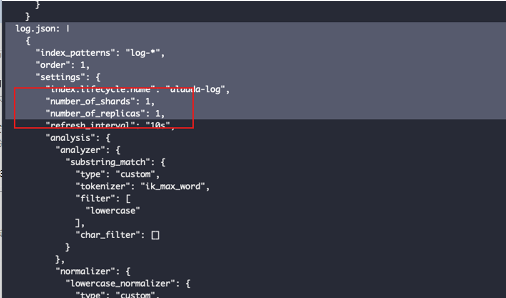

---
kind:
  - Troubleshooting
products:
  - Alauda Container Platform
  - Alauda DevOps
  - Alauda AI
  - Alauda Application Services
  - Alauda Service Mesh
  - Alauda Developer Portal
ProductsVersion:
  - 4.1.0,4.2.x
---
<!-- A type of document that involves encountering a fault, diagnosing it, performing root cause analysis, and providing solutions. -->

# 修改ES默认配置（分片和副本数）

单个索引大，磁盘分配不均衡

## Cause
- 默认分片数配置为1

## Resolution
- 修改aiops-config ConfigMap
- 重启lanaya
- 等待第二天索引模板生效

## [workaround]

## [Related Information]
**Screenshots**

- Environment: 3.6+
- aiops-config
- 索引模板
- Elasticsearch
- Component: (待归类)
- Page ID: 136519180
- Original Title: 修改ES默认配置（分片和副本数）
