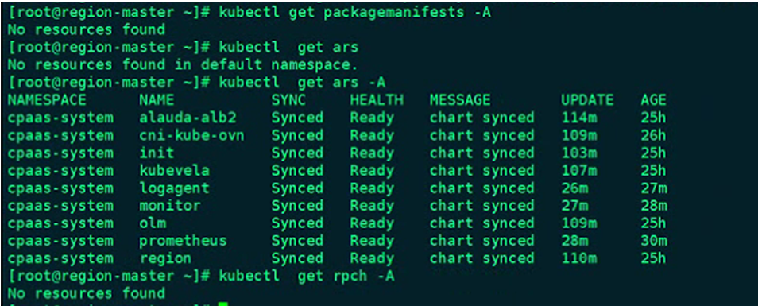

---
kind:
  - Troubleshooting
products:
  - Alauda Container Platform
  - Alauda DevOps
  - Alauda AI
  - Alauda Application Services
  - Alauda Service Mesh
  - Alauda Developer Portal
ProductsVersion:
  - 4.1.0,4.2.x
---
<!-- A type of document that involves encountering a fault, diagnosing it, performing root cause analysis, and providing solutions. -->

# 3.8+3.10 新建业务集群operator hub不显示

operator hub不显示operators csv, subs没有数据 packagemanifests不存在资源

## Cause

## Resolution
- 重新部署业务集群

## [workaround]
- 手动更新artifactVersion字段触发同步: kubectl proxy &; export ArtifactName=$(kubectl get artifact -A -l source!=charts | awk '{if($2!="NAME")  print $2}'); for name in $ArtifactName; do curl -k -s -X PATCH -H "Accept: application/json, */*" -H "Content-Type: application/merge-patch+json" 127.0.0.1:8001/apis/app.alauda.io/v1alpha1/namespaces/cpaas-system/artifacts/${name}/status --data '{"status":{"synced":false}}'; done

## [Related Information]
**Screenshots**

- csv
- subs
- artifacts
- artifactversion
- catalog
- library
- packagemanifests
- ars
- rpch
- Component: (待归类)
- Page ID: 136524471
- Original Title: 3.8+3.10 新建业务集群operator hub不显示
