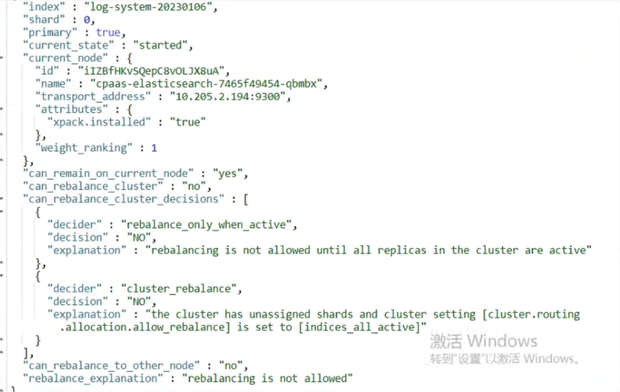

---
kind:
  - Troubleshooting
products:
  - Alauda Container Platform
  - Alauda DevOps
  - Alauda AI
  - Alauda Application Services
  - Alauda Service Mesh
  - Alauda Developer Portal
ProductsVersion:
  - 4.1.0,4.2.x
---
<!-- A type of document that involves encountering a fault, diagnosing it, performing root cause analysis, and providing solutions. -->

# 平台es集群状态告警

所有索引状态为yellow 分片分配失败提示无法在节点上分配副本分片

## Cause
- 单节点部署场景下默认索引副本数配置为2
- 副本分片无法分配到其他节点导致unassigned shards

## Resolution
- 将cm aiops-logging-config中number_of_replicas参数调整为0
- 执行索引副本清理操作

## [workaround]

## [Related Information]
**Screenshots**

- Environment: 3.8.3
- cluster.routing.allocation.allow_rebalance
- number_of_replicas
- cm aiops-logging-config
- 索引副本机制
- Component: (待归类)
- Page ID: 136528400
- Original Title: 平台es集群状态告警
