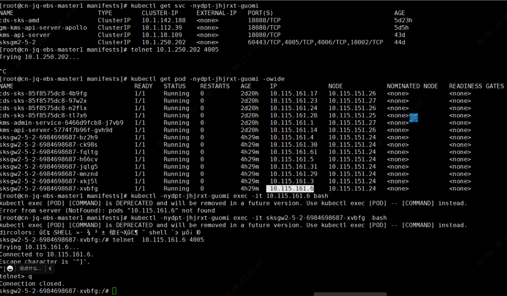
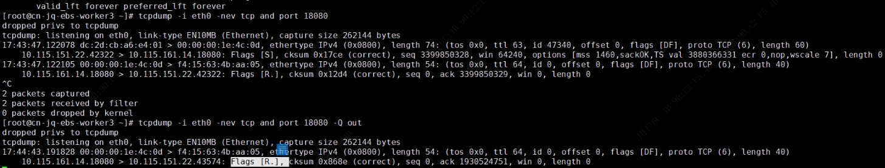

---
kind:
  - Troubleshooting
products:
  - Alauda Container Platform
  - Alauda DevOps
  - Alauda AI
  - Alauda Application Services
  - Alauda Service Mesh
  - Alauda Developer Portal
ProductsVersion:
  - 4.1.0,4.2.x
---
<!-- A type of document that involves encountering a fault, diagnosing it, performing root cause analysis, and providing solutions. -->

# underlay添加子网后关联的ns下应用svc层面网络不通

同命名空间内可访问SVC和Pod的IP及端口 宿主机及其他命名空间无法访问SVC和Pod的IP及端口

## Cause
- 应用侧主动返回TCP Reset导致连接中断

## Resolution
- 调整业务应用代码以修复TCP Reset问题

## [workaround]

## [Related Information]
**Screenshots**

- Environment: TKE 3.8.2
- 18080
- eth0
- tcp
- tcpdump -i eth0 -nev tcp and port 18080 -Q out
- Component: (待归类)
- Page ID: 136533320
- Original Title: underlay添加子网后关联的ns下应用svc层面网络不通
