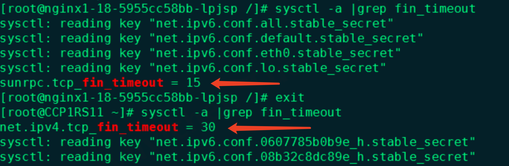

---
kind:
  - Troubleshooting
products:
  - Alauda Container Platform
  - Alauda DevOps
  - Alauda AI
  - Alauda Application Services
  - Alauda Service Mesh
  - Alauda Developer Portal
ProductsVersion:
  - 4.1.0,4.2.x
---
<!-- A type of document that involves encountering a fault, diagnosing it, performing root cause analysis, and providing solutions. -->

# 容器的内核参数和宿主机不一致

容器内使用 sunrpc.tcp_fin_timeout 参数，宿主机使用 net.ipv4.tcp_fin_timeout 参数 容器与宿主机内核参数值不一致

## Cause
- UBI 7.9 系统镜像缺少 net.ipv4.tcp 参数包
- 不同基础镜像系统(sysctl 参数包差异)

## Resolution
- 确保容器镜像存在目标内核参数
- 通过 securityContext.sysctls 字段配置参数

## [workaround]

## [Related Information]
**Screenshots**

- Environment: TKE 3.6
- sunrpc.tcp_fin_timeout
- net.ipv4.tcp_fin_timeout
- securityContext
- alpine
- ubi 7.9
- Component: (待归类)
- Page ID: 136533328
- Original Title: 容器的内核参数和宿主机不一致
