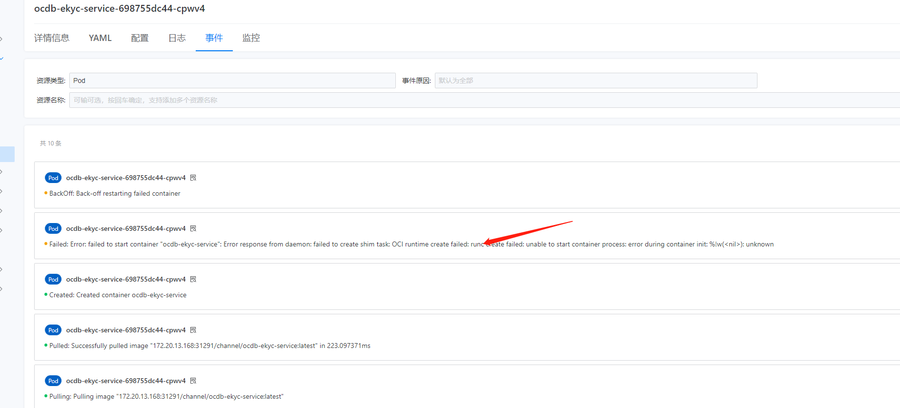
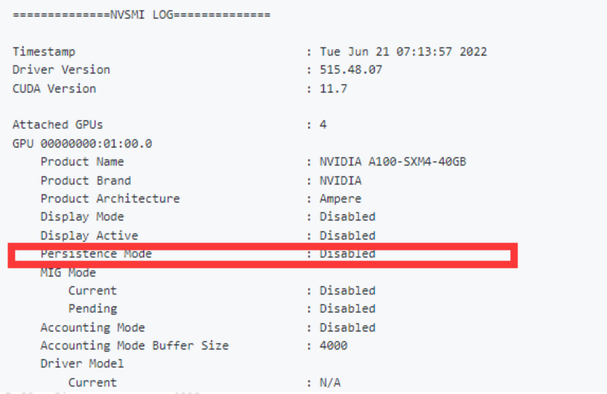

---
kind:
  - Troubleshooting
products:
  - Alauda Container Platform
  - Alauda DevOps
  - Alauda AI
  - Alauda Application Services
  - Alauda Service Mesh
  - Alauda Developer Portal
ProductsVersion:
  - 4.1.0,4.2.x
---
<!-- A type of document that involves encountering a fault, diagnosing it, performing root cause analysis, and providing solutions. -->

# gpu容器启动失败

容器卡在creating状态 OCI runtime create failed: runc create failed: unable to start container process: error during container init

## Cause
- nvidia-persistenced daemon未开启导致获取GPU信息超时

## Resolution
- 在GPU节点执行nvidia-smi -pm ENABLED开启持久化模式
- 删除本地镜像并重新拉取

## [workaround]

## [Related Information]
**Screenshots**

- Environment: 3.x版本GPU集群
- nvidia-persistenced
- OCI runtime
- runc
- nvidia-smi
- ocdb-ekyc-mykad容器
- Component: (待归类)
- Page ID: 136534064
- Original Title: gpu容器启动失败
