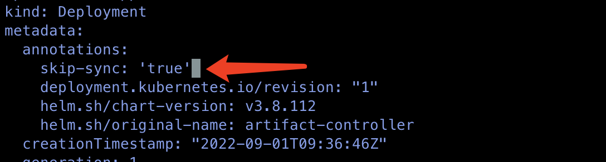

---
kind:
  - Troubleshooting
products:
  - Alauda Container Platform
  - Alauda DevOps
  - Alauda AI
  - Alauda Application Services
  - Alauda Service Mesh
  - Alauda Developer Portal
ProductsVersion:
  - 4.1.0,4.2.x
---
<!-- A type of document that involves encountering a fault, diagnosing it, performing root cause analysis, and providing solutions. -->

# olm

olm-registry-system(platform) replicaSet资源无限递增 产生多个olm-registry-system和olm-registry-platform的pod

## Cause
- controller每12小时自动reconcile触发artifact-controller更新olm-registry deployment

## Resolution
- kubectl edit deploy -n cpaas-system artifact-controller 修改replicas为0
- 在annotations字段增加skip-sync: 'true'标签

## [workaround]

## [Related Information]
**Screenshots**

- Environment: 3.6.x
- artifact-controller
- olm-registry
- cpaas-system
- skip-sync
- replicas
- Component: (待归类)
- Page ID: 136538496
- Original Title: olm-registry-system(platform) replicaSet资源无限递增
