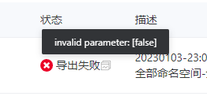
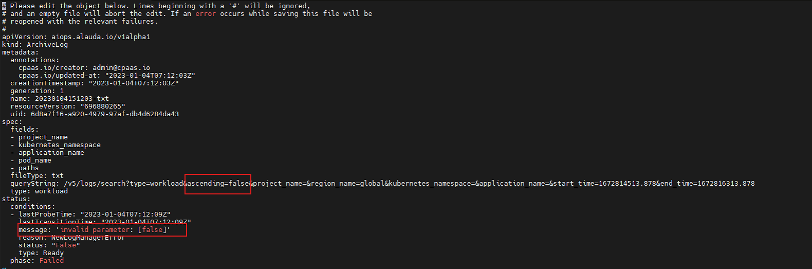

---
kind:
  - Troubleshooting
products:
  - Alauda Container Platform
  - Alauda DevOps
  - Alauda AI
  - Alauda Application Services
  - Alauda Service Mesh
  - Alauda Developer Portal
ProductsVersion:
  - 4.1.0,4.2.x
---
<!-- A type of document that involves encountering a fault, diagnosing it, performing root cause analysis, and providing solutions. -->

# 日志导出功能异常，报错invalid paramer: [false]

日志导出功能异常，报错invalid paramer: [false]

## Cause
- 当前版本产品bug导致不识别queryString中的ascending参数

## Resolution
- 更新平台版本至3.10.2

## [workaround]
- 手动将ascending=false参数从请求中移除后重新执行导出

## [Related Information]
**Screenshots**

- Environment: 3.10.1
- archivelog
- queryString
- ascending
- Component: (待归类)
- Page ID: 136541835
- Original Title: 日志导出功能异常，报错invalid paramer: [false]
