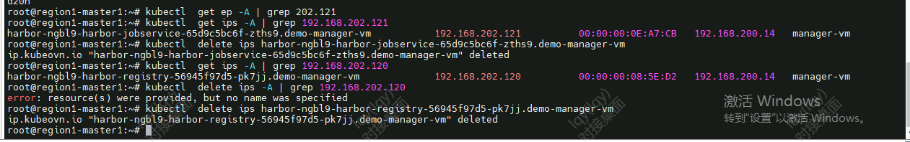

---
kind:
  - Troubleshooting
products:
  - Alauda Container Platform
  - Alauda DevOps
  - Alauda AI
  - Alauda Application Services
  - Alauda Service Mesh
  - Alauda Developer Portal
ProductsVersion:
  - 4.1.0,4.2.x
---
<!-- A type of document that involves encountering a fault, diagnosing it, performing root cause analysis, and providing solutions. -->

# 3.10

子网状态持续显示为'删除中'无法完成删除

## Cause
- 已分配的IP地址未被释放导致子网删除受阻

## Resolution
- 执行命令检查残留IP资源: kubectl get ips -A | grep 192.168.202.121
- 手动删除残留IP资源: kubectl delete ips xxxxxxxxxxxx

## [workaround]

## [Related Information]
**Screenshots**

- Environment: 3.10,3.8
- ips资源
- 子网资源
- 192.168.202.121
- Component: (待归类)
- Page ID: 139659074
- Original Title: 3.10-网络-子网无法删除
