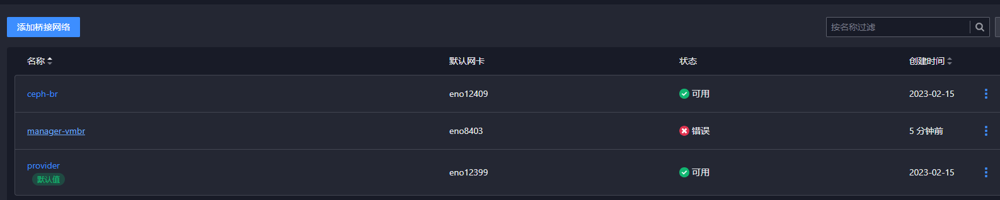
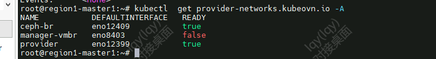
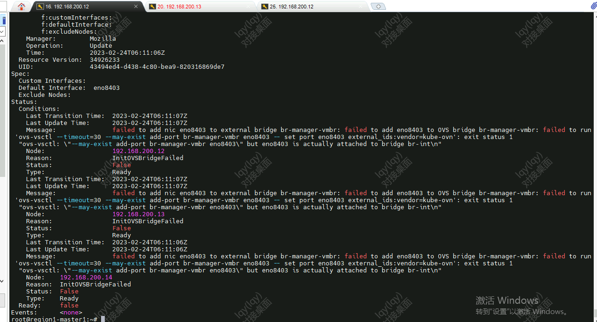

---
kind:
  - Troubleshooting
products:
  - Alauda Container Platform
  - Alauda DevOps
  - Alauda AI
  - Alauda Application Services
  - Alauda Service Mesh
  - Alauda Developer Portal
ProductsVersion:
  - 4.1.0,4.2.x
---
<!-- A type of document that involves encountering a fault, diagnosing it, performing root cause analysis, and providing solutions. -->

# 3.10

创建桥接网络报错 1、通过下面命令查看桥接网络的报错原因

## Cause

## Resolution
- kubectl get provider-networks -A
- kubectl describe provider-networks xxxxxxx
- 2、判断eno8403网卡已经连接到网桥br-int了，需要先和br-int分离开才能和你创建的manager-vmbr链接
- ## 解决方案
- 1、分别进入到3个ovn-central容器内（注意以下操作需要在三个ovn-central容器内执行）
- kubectl exec -ti -n kube-system ovn-central-xxxxxx bash
- 3、执行命令进行删除br-int网桥下的eno8403网卡
- 执行完毕后，界面桥接网络显示正常。

## [workaround]

## [Related Information]
**Screenshots**

- 10
- 81
- 88
- 29
- /3-10-wang-luo-qiao-jie-wang-luo-chuang-jian-shi-bai/
- 22
- 14
- 282
- 281
- /3-10-wang-luo-qiao-jie-wang-luo-chuang-jian-shi-bai/image2023-2-24_15-22-14.png
- Component: (待归类)
- Page ID: 139659106
- Original Title: 3.10-网络-桥接网络创建失败
