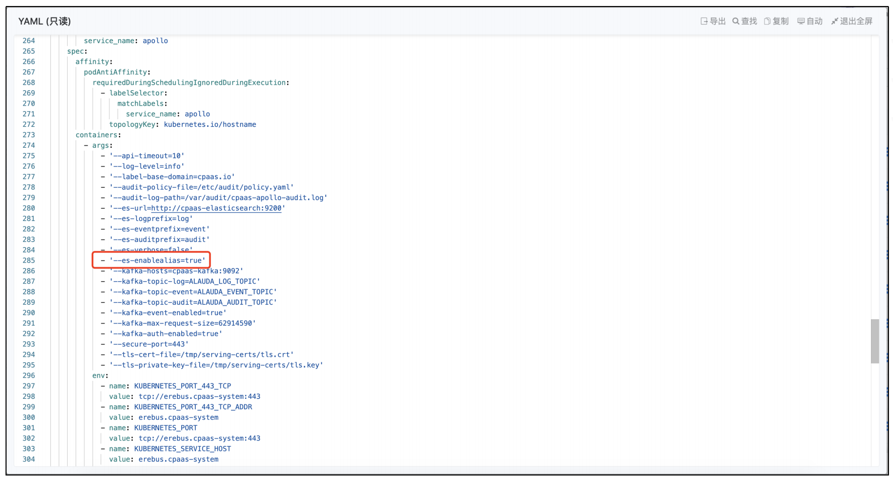

---
kind:
  - Troubleshooting
products:
  - Alauda Container Platform
  - Alauda DevOps
  - Alauda AI
  - Alauda Application Services
  - Alauda Service Mesh
  - Alauda Developer Portal
ProductsVersion:
  - 4.1.0,4.2.x
---
<!-- A type of document that involves encountering a fault, diagnosing it, performing root cause analysis, and providing solutions. -->

# 日志

测试日志保留策略时生成7天日志周期过长

## Cause
- 实际测试需要快速验证多日日志场景但无法等待真实7天周期

## Resolution
- 通过Elasticsearch _reindex API复制索引并调整时间戳: POST _reindex {"source":{"index":"<源index>"},"dest":{"index":"<目的index>"},"script":{"source":"ctx._source.time = ctx._source.time - 86400000000L"}}
- 修改Apollo配置项es-enablealias=false

## [workaround]

## [Related Information]
**Screenshots**

- Environment: Elasticsearch & Apollo配置环境
- log-workload-*索引
- ctx._source.time字段
- es-enablealias配置项
- Kibana开发者工具
- _reindex API
- Component: (待归类)
- Page ID: 139662731
- Original Title: 日志-复制 index 填充测试数据
