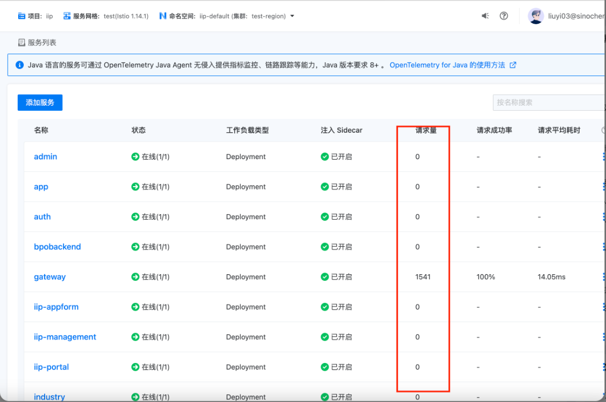
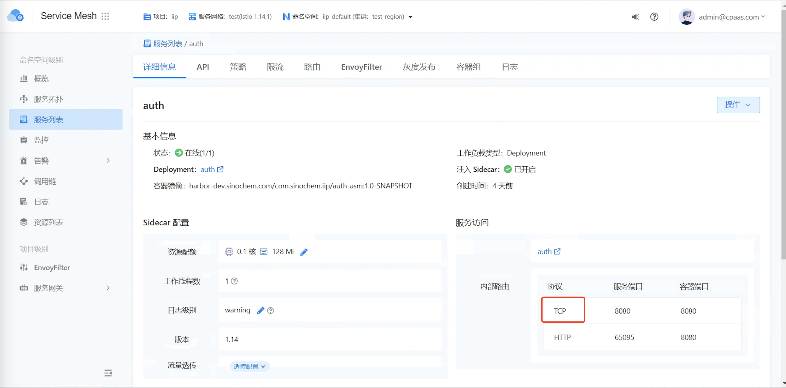

---
kind:
  - Troubleshooting
products:
  - Alauda Container Platform
  - Alauda DevOps
  - Alauda AI
  - Alauda Application Services
  - Alauda Service Mesh
  - Alauda Developer Portal
ProductsVersion:
  - 4.1.0,4.2.x
---
<!-- A type of document that involves encountering a fault, diagnosing it, performing root cause analysis, and providing solutions. -->

# asm看不到访问量

asm看不到auth应用的访问量 直接请求容器IP+端口仍无流量记录 admin服务有请求量显示

## Cause
- 服务协议配置不正确

## Resolution
- 修改服务协议为http

## [workaround]

## [Related Information]
**Screenshots**

- Environment: TKE 3.10
- /api/auth/oauth/token
- /oauth/token
- auth应用
- gateway
- admin服务
- 协议配置
- Component: (待归类)
- Page ID: 140806046
- Original Title: asm看不到访问量
