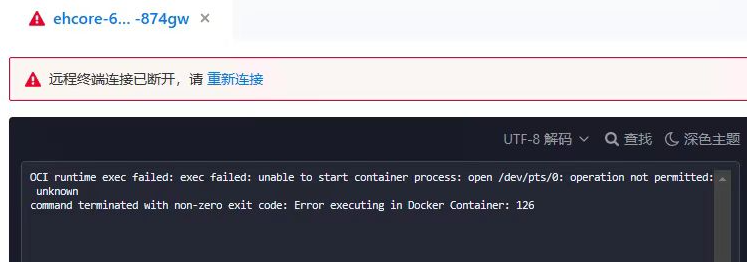
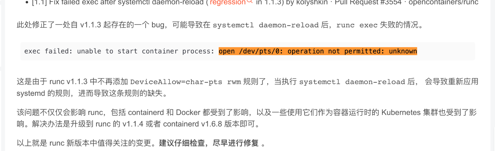

---
kind:
  - Troubleshooting
products:
  - Alauda Container Platform
  - Alauda DevOps
  - Alauda AI
  - Alauda Application Services
  - Alauda Service Mesh
  - Alauda Developer Portal
ProductsVersion:
  - 4.1.0,4.2.x
---
<!-- A type of document that involves encountering a fault, diagnosing it, performing root cause analysis, and providing solutions. -->

# 容器exec问题

exec failed: unable to start container process: open /dev/pts/0: operation not permitted: unknow

## Cause
- runc v1.1.3 中不再添加 DeviceAllow=char-pts rwm 规则
- 执行 systemctl daemon-reload 导致规则丢失

## Resolution
- 重启容器

## [workaround]

## [Related Information]
**Screenshots**

- Environment: TKE 3.10
- runc
- /dev/pts
- DeviceAllow
- systemd
- Component: (待归类)
- Page ID: 140806755
- Original Title: 容器exec问题
