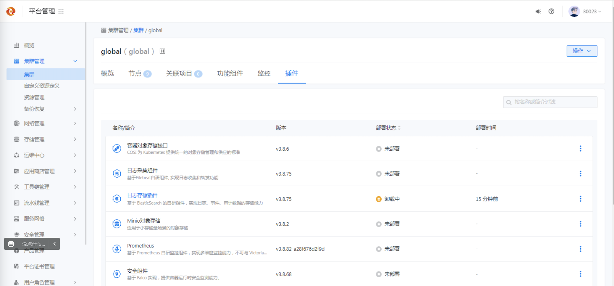
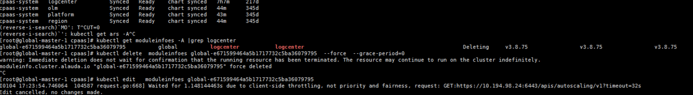

---
kind:
  - Troubleshooting
products:
  - Alauda Container Platform
  - Alauda DevOps
  - Alauda AI
  - Alauda Application Services
  - Alauda Service Mesh
  - Alauda Developer Portal
ProductsVersion:
  - 4.1.0,4.2.x
---
<!-- A type of document that involves encountering a fault, diagnosing it, performing root cause analysis, and providing solutions. -->

# 卸载日志组件卡住

卸载日志组件卡住，前端页面一直显示卸载中

## Cause

## Resolution

## [workaround]

## [Related Information]
**Screenshots**

- Environment: TKE 3.8
- minifo
- Component: (待归类)
- Page ID: 140806886
- Original Title: 卸载日志组件卡住
