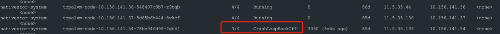

---
kind:
  - Troubleshooting
products:
  - Alauda Container Platform
  - Alauda DevOps
  - Alauda AI
  - Alauda Application Services
  - Alauda Service Mesh
  - Alauda Developer Portal
ProductsVersion:
  - 4.1.0,4.2.x
---
<!-- A type of document that involves encountering a fault, diagnosing it, performing root cause analysis, and providing solutions. -->

# topolvm节点状态未知，pod处于crash状态

节点状态显示未知 pod处于crash状态

## Cause
- 节点防火墙开启导致10250端口不通

## Resolution
- 关闭节点firewalld服务
- 重启topolvm-node pod

## [workaround]

## [Related Information]
**Screenshots**

- Environment: 通用
- 10250端口
- topolvm-node pod
- firewalld服务
- Component: (待归类)
- Page ID: 140807399
- Original Title: topolvm节点状态未知，pod处于crash状态
