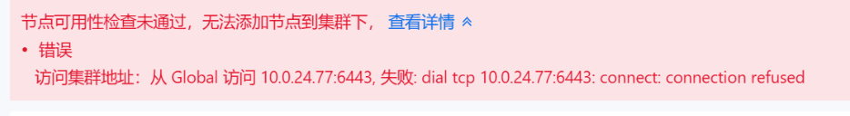

---
kind:
  - Troubleshooting
products:
  - Alauda Container Platform
  - Alauda DevOps
  - Alauda AI
  - Alauda Application Services
  - Alauda Service Mesh
  - Alauda Developer Portal
ProductsVersion:
  - 4.1.0,4.2.x
---
<!-- A type of document that involves encountering a fault, diagnosing it, performing root cause analysis, and providing solutions. -->

# 创建业务集群失败

创建业务集群添加节点时检测到master节点连接拒绝

## Cause
- 节点主机名称包含下划线（不符合命名规范）

## Resolution
- 通过 hostnamectl set-hostname xxx 修改符合规范的主机名称

## [workaround]

## [Related Information]
**Screenshots**

- Environment: 3.11
- hostname配置
- tke-platform组件
- cluster-transfer组件
- 6443端口
- Component: (待归类)
- Page ID: 140807645
- Original Title: 创建业务集群失败
