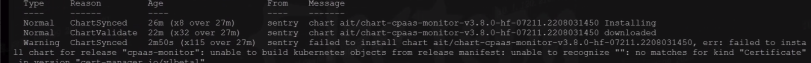
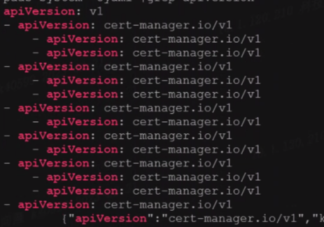
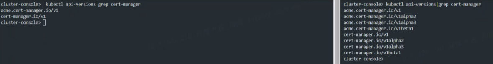

---
kind:
  - Troubleshooting
products:
  - Alauda Container Platform
  - Alauda DevOps
  - Alauda AI
  - Alauda Application Services
  - Alauda Service Mesh
  - Alauda Developer Portal
ProductsVersion:
  - 4.1.0,4.2.x
---
<!-- A type of document that involves encountering a fault, diagnosing it, performing root cause analysis, and providing solutions. -->

# 接入集群部署监控失败

no matches for kind "certficate" in version "cert-manager.io/v1beta1" ars部署失败

## Cause
- certificates.cert-manager.io 这个 CRD 被修改过

## Resolution
- 使用正常集群的 certificates.crd 覆盖问题集群的 CRD

## [workaround]

## [Related Information]
**Screenshots**

- Environment: 3.8
- cert-manager.io/v1beta1
- certificates.crd
- cert-manager
- Component: (待归类)
- Page ID: 140808901
- Original Title: 接入集群部署监控失败
