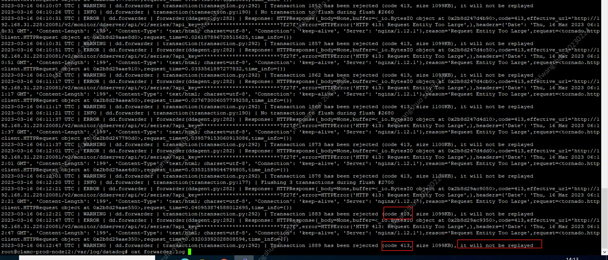
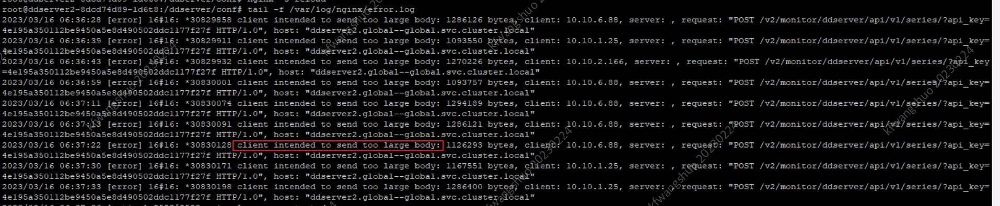

---
kind:
  - Troubleshooting
products:
  - Alauda Container Platform
  - Alauda DevOps
  - Alauda AI
  - Alauda Application Services
  - Alauda Service Mesh
  - Alauda Developer Portal
ProductsVersion:
  - 4.1.0,4.2.x
---
<!-- A type of document that involves encountering a fault, diagnosing it, performing root cause analysis, and providing solutions. -->

# 1.13 节点或容器监控部分缺失

节点监控部分不显示 节点上容器监控丢失 ddagent容器/var/log/datadog/collector.log存在413报错

## Cause
- 收集的监控数据大小超过ddserver(nginx)默认上传大小导致数据被丢弃

## Resolution
- 修改ddserver的nginx配置，取消client_max_body_size限制
- kubectl exec -it -n global--global ddserver2-8dawd4cd9-wc12c bash
- vi /ddserver/conf/nginx.conf
- 在server块添加client_max_body_size 0;
- nginx -s reload
- 其他两个ddserver重复配置

## [workaround]

## [Related Information]
**Screenshots**

- Environment: AEE 1.13
- ddagent容器
- ddserver2组件
- /var/log/datadog/collector.log
- client_max_body_size
- nginx.conf
- Component: (待归类)
- Page ID: 140814966
- Original Title: 1.13 节点或容器监控部分缺失
