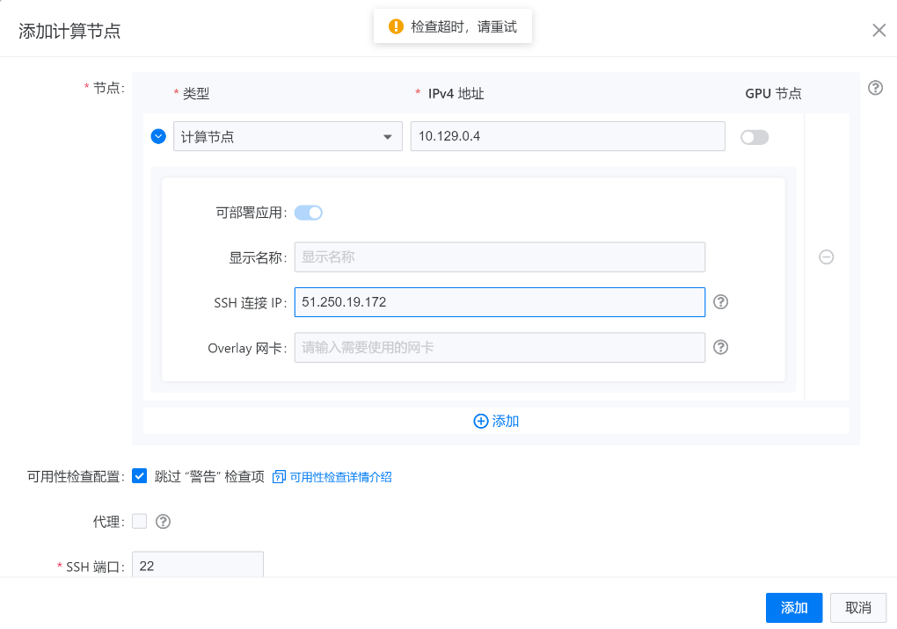

---
kind:
  - Troubleshooting
products:
  - Alauda Container Platform
  - Alauda DevOps
  - Alauda AI
  - Alauda Application Services
  - Alauda Service Mesh
  - Alauda Developer Portal
ProductsVersion:
  - 4.1.0,4.2.x
---
<!-- A type of document that involves encountering a fault, diagnosing it, performing root cause analysis, and providing solutions. -->

# 3.10.0

添加集群节点时报错检查超时，提示请重试 tke-platform-api服务报空指针错误并触发重启

## Cause
- 3.10.0版本无法识别4096位长度的SSH密钥格式

## Resolution
- 更换为密码登录方式
- 使用ssh-keygen -b 2048重新生成2048位密钥

## [workaround]

## [Related Information]
**Screenshots**

- Environment: TKE 3.10.0版本
- tke-platform-api
- SSH连接
- 密钥认证
- ssh-keygen
- Component: (待归类)
- Page ID: 140816927
- Original Title: 3.10.0-添加集群节点报错-检查超时 请重试
