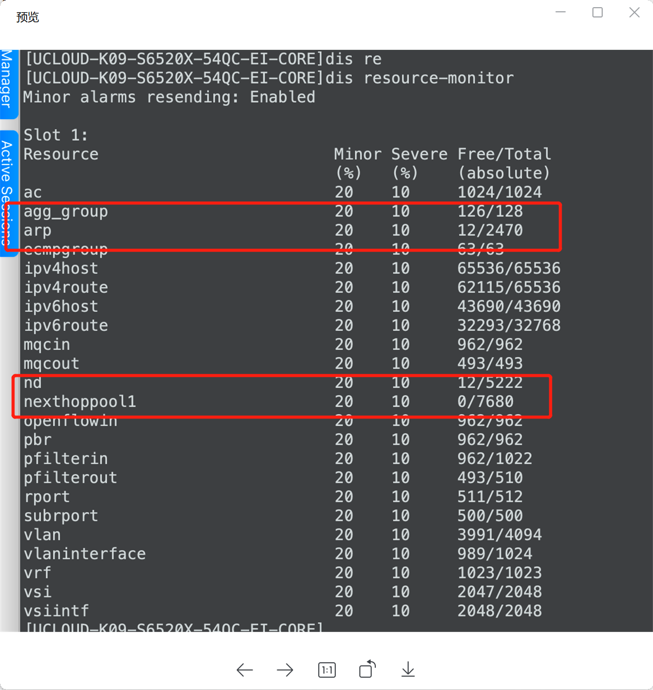
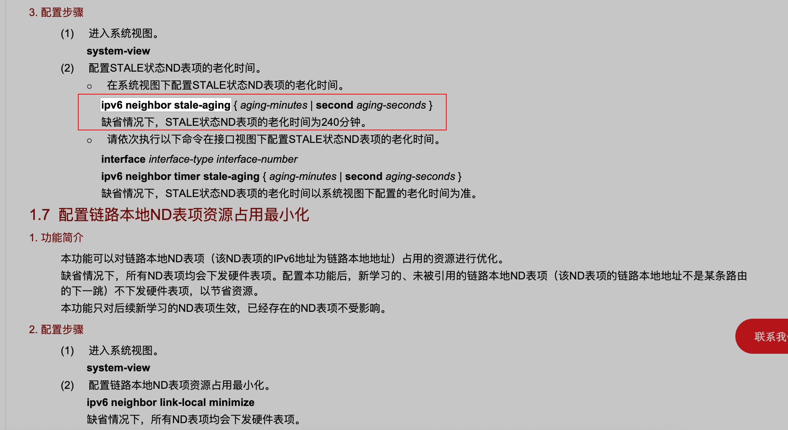

---
kind:
  - Troubleshooting
products:
  - Alauda Container Platform
  - Alauda DevOps
  - Alauda AI
  - Alauda Application Services
  - Alauda Service Mesh
  - Alauda Developer Portal
ProductsVersion:
  - 4.1.0,4.2.x
---
<!-- A type of document that involves encountering a fault, diagnosing it, performing root cause analysis, and providing solutions. -->

# 测试环境几个集群同时出现underlay网络不通

underlay网络访问api-server偶发不通 出现不通的频率较高

## Cause
- 华三交换机的ND表项已满
- ND表项过多占用nexthoppool1资源
- 路由无法正常配置

## Resolution
- 修改ND老化时间从240分钟调整为20分钟

## [workaround]

## [Related Information]
**Screenshots**

- Environment: 测试环境（使用华三交换机）
- 华三交换机
- ND表
- nexthoppool1
- api-server
- vxlan
- relay路由
- Component: (待归类)
- Page ID: 140823441
- Original Title: 测试环境几个集群同时出现underlay网络不通
