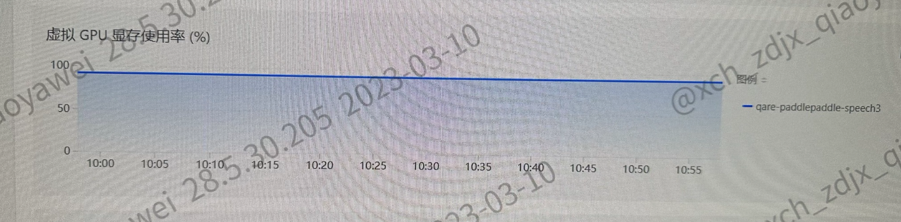
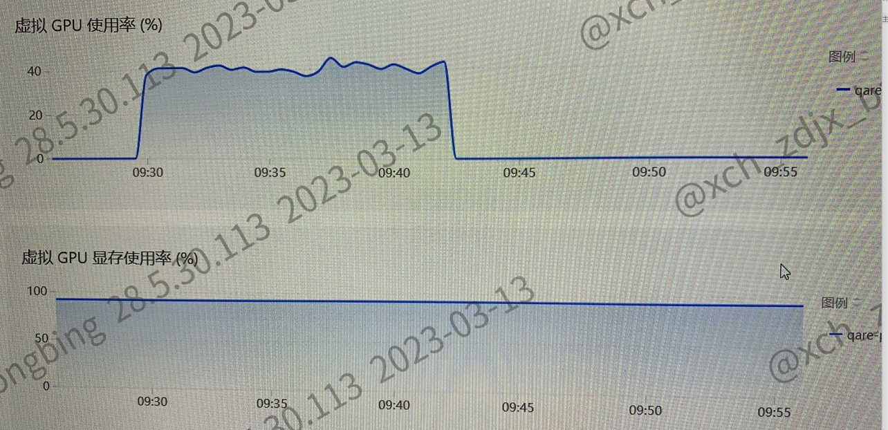

---
kind:
  - Troubleshooting
products:
  - Alauda Container Platform
  - Alauda DevOps
  - Alauda AI
  - Alauda Application Services
  - Alauda Service Mesh
  - Alauda Developer Portal
ProductsVersion:
  - 4.1.0,4.2.x
---
<!-- A type of document that involves encountering a fault, diagnosing it, performing root cause analysis, and providing solutions. -->

# 客户测试业务的时候，显存使用率监控一直都是固定的

显存使用率监控曲线无波动 容器内nvidia-smi无进程占用 物理机nvidia-smi显示94%显存占用

## Cause
- 应用未释放显存资源
- 使用Deployment方式运行训练任务导致pod未回收

## Resolution
- 改用Job/CronJob方式运行训练任务
- 任务结束自动回收pod释放GPU资源
- 检查应用层显存释放机制

## [workaround]

## [Related Information]
**Screenshots**

- Environment: 3.10.1
- nvidia-smi
- Job
- CronJob
- Deployment
- GPU资源释放
- Component: (待归类)
- Page ID: 140824284
- Original Title: 客户测试业务的时候，显存使用率监控一直都是固定的
