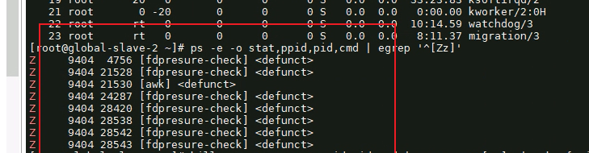
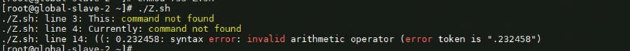
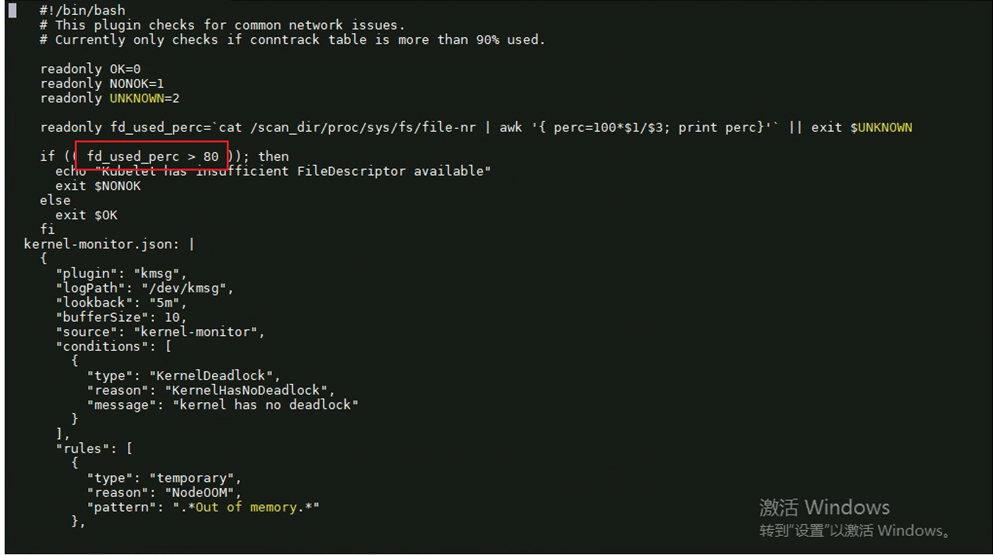

---
kind:
  - Troubleshooting
products:
  - Alauda Container Platform
  - Alauda DevOps
  - Alauda AI
  - Alauda Application Services
  - Alauda Service Mesh
  - Alauda Developer Portal
ProductsVersion:
  - 4.1.0,4.2.x
---
<!-- A type of document that involves encountering a fault, diagnosing it, performing root cause analysis, and providing solutions. -->

# 主机节点nevermore僵尸进程告警

僵尸进程数>5 node-problem-detector容器内fdpresure-check进程异常 手动运行fdpresure-check.sh报错

## Cause
- fdpresure-check.sh脚本中if条件判断使用(())导致语法错误

## Resolution
- kubectl edit cm -n cpaas-system node-problem-detector-config
- 修改if (( fd_used_perc > 80 ))为if [[ fd_used_perc > 80 ]]

## [workaround]

## [Related Information]
**Screenshots**

- Environment: 3.6以上
- fdpresure-check.sh
- node-problem-detector
- node-problem-detector-config
- Component: (待归类)
- Page ID: 140824491
- Original Title: 基础架构-主机节点nevermore僵尸进程告警
