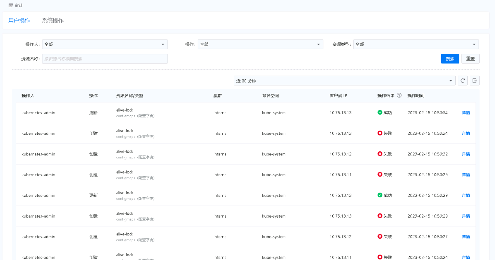

---
kind:
  - Troubleshooting
products:
  - Alauda Container Platform
  - Alauda DevOps
  - Alauda AI
  - Alauda Application Services
  - Alauda Service Mesh
  - Alauda Developer Portal
ProductsVersion:
  - 4.1.0,4.2.x
---
<!-- A type of document that involves encountering a fault, diagnosing it, performing root cause analysis, and providing solutions. -->

# 3.8.2

审计中存在很多alive-lock配置文件创建失败记录

## Cause
- 业务集群使用自建vip部署，alive-lock配置文件用于vip绑定检测

## Resolution
- 升级到3.11及以上版本（自建vip检测机制已变更）

## [workaround]

## [Related Information]
**Screenshots**

- Environment: 3.8.2
- alive-lock配置文件
- 自建vip
- Component: (待归类)
- Page ID: 140824712
- Original Title: 3.8.2-基础架构-审计中很多alive-lock配置文件创建失败
