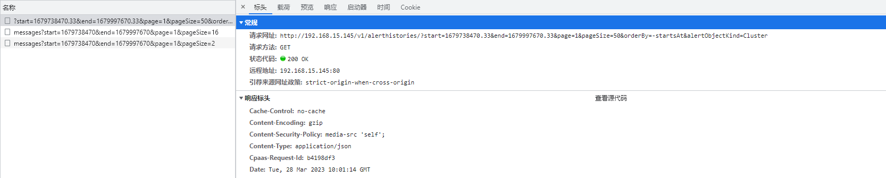
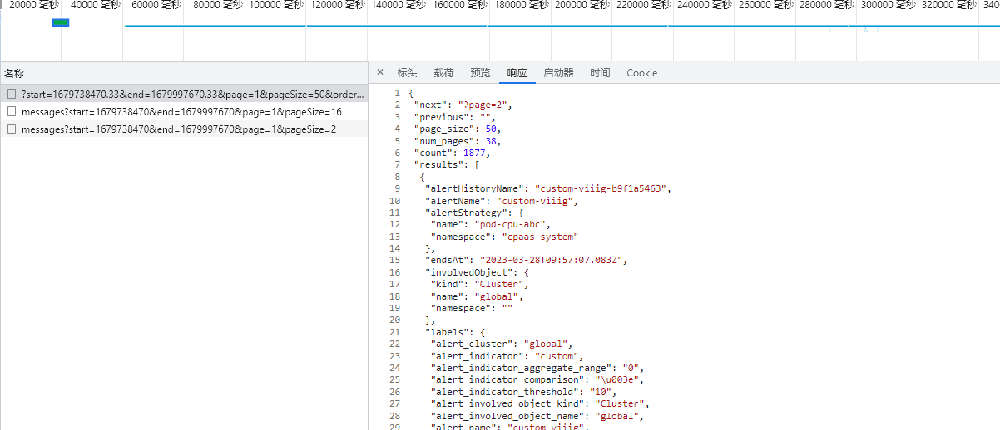
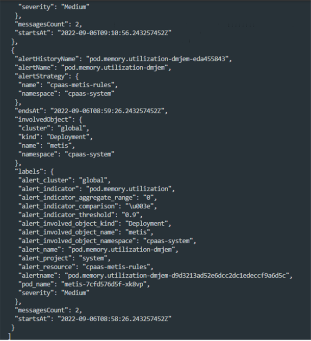

---
kind:
  - Troubleshooting
products:
  - Alauda Container Platform
  - Alauda DevOps
  - Alauda AI
  - Alauda Application Services
  - Alauda Service Mesh
  - Alauda Developer Portal
ProductsVersion:
  - 4.1.0,4.2.x
---
<!-- A type of document that involves encountering a fault, diagnosing it, performing root cause analysis, and providing solutions. -->

# 如何统计告警历史总次数

JIRA Jira：

## Cause

## Resolution
- 查看审计日志保存天数配置，通过浏览器开发者工具(F12)筛选对应时间范围的告警数据
- 导出告警历史数据到文件，过滤'messagesCount'字段并进行求和计算

## [workaround]

## [Related Information]
**Screenshots**

- Environment: Jira
- 审计日志保存天数配置
- messagesCount
- Component: (待归类)
- Page ID: 140825197
- Original Title: 基础架构-如何统计告警历史总次数
