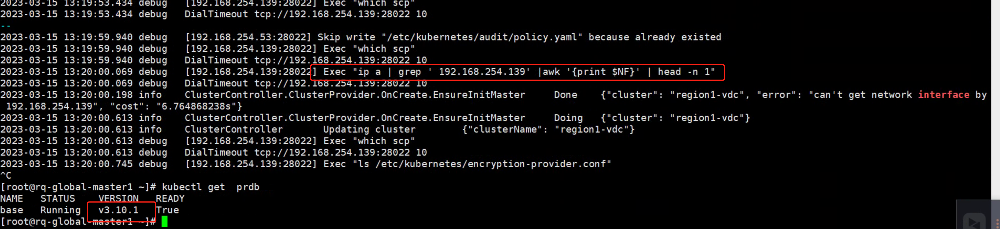

---
kind:
  - Troubleshooting
products:
  - Alauda Container Platform
  - Alauda DevOps
  - Alauda AI
  - Alauda Application Services
  - Alauda Service Mesh
  - Alauda Developer Portal
ProductsVersion:
  - 4.1.0,4.2.x
---
<!-- A type of document that involves encountering a fault, diagnosing it, performing root cause analysis, and providing solutions. -->

# 3.10.1

创建高可用集群时报错: can't get network interface by <IP> 单master节点集群无此问题

## Cause
- 通过SSH公网IP添加节点时，节点上不存在该IP对应的物理网卡（因使用网络转发/NAT）
- tke-platform-controller的eip检查机制无法识别转发IP的网卡信息

## Resolution
- 升级到3.10.3版本修复该问题

## [workaround]

## [Related Information]
**Screenshots**

- Environment: 3.10.1
- tke-platform-controller
- eip检查机制
- network interface检查
- Component: (待归类)
- Page ID: 144900964
- Original Title: 3.10.1-创建业务集群失败
