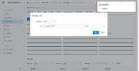
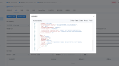
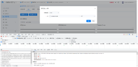

---
kind:
  - Troubleshooting
products:
  - Alauda Container Platform
  - Alauda DevOps
  - Alauda AI
  - Alauda Application Services
  - Alauda Service Mesh
  - Alauda Developer Portal
ProductsVersion:
  - 4.1.0,4.2.x
---
<!-- A type of document that involves encountering a fault, diagnosing it, performing root cause analysis, and providing solutions. -->

# 3.10.2

手动录入API时出现错误 已有ApiAttribute资源时通过PATCH方式添加API失败

## Cause
- 已存在的ApiAttribute资源缺少spec.apis字段
- 自动导入API失败导致ApiAttribute资源状态异常

## Resolution
- 删除对应服务的ApiAttribute资源：kubectl delete apiattribute -n xxx xxx

## [workaround]
- 先通过批量导入API创建有效的ApiAttribute资源后再手动添加

## [Related Information]
**Screenshots**

- Environment: 3.10
- ApiAttribute
- kubectl
- spec.apis
- Component: (待归类)
- Page ID: 149592859
- Original Title: 3.10.2-ASM手动录入API报错
