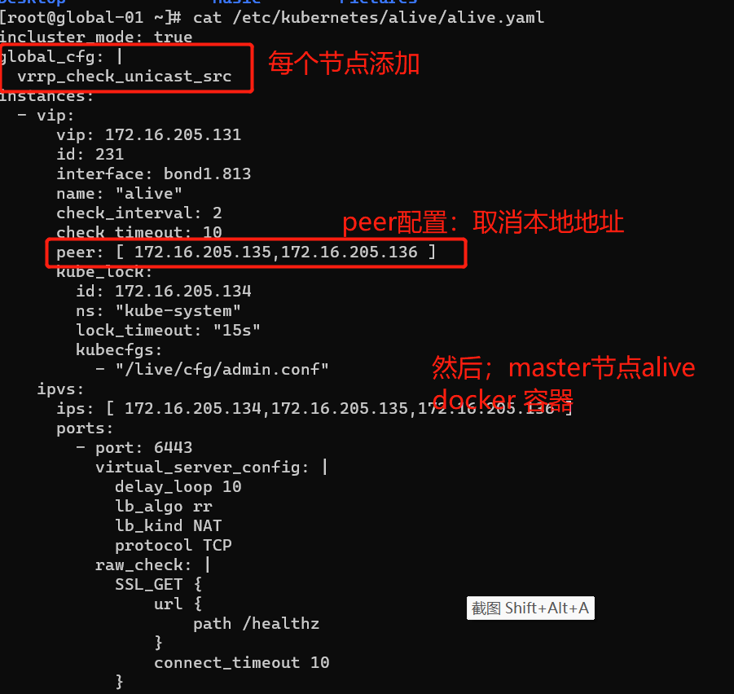

---
kind:
  - Troubleshooting
products:
  - Alauda Container Platform
  - Alauda DevOps
  - Alauda AI
  - Alauda Application Services
  - Alauda Service Mesh
  - Alauda Developer Portal
ProductsVersion:
  - 4.1.0,4.2.x
---
<!-- A type of document that involves encountering a fault, diagnosing it, performing root cause analysis, and providing solutions. -->

# 多网卡自建vip问题

无法通过vip进行访问 keepalived自己节点的另一个ip发vrrp导致leader被自己抢占

## Cause
- 未指定vrrp_check_unicast_src配置
- peer配置中包含自己的ip

## Resolution
- 在global master节点添加vrrp_check_unicast_src配置
- 删除keepalived配置中的peer配置
- 重建节点上keepalived容器

## [workaround]

## [Related Information]
**Screenshots**

- Environment: 3.8.x
- keepalived配置
- vrrp_check_unicast_src
- peer配置
- Component: (待归类)
- Page ID: 149593991
- Original Title: 多网卡自建vip问题
