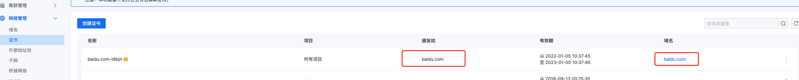

---
kind:
  - Troubleshooting
products:
  - Alauda Container Platform
  - Alauda DevOps
  - Alauda AI
  - Alauda Application Services
  - Alauda Service Mesh
  - Alauda Developer Portal
ProductsVersion:
  - 4.1.0,4.2.x
---
<!-- A type of document that involves encountering a fault, diagnosing it, performing root cause analysis, and providing solutions. -->

# 入站网关添加https协议监听时，无法选择证书

添加https协议监听时无法选择证书（域名已配置证书）

## Cause
- 证书未颁发给对应域名
- 证书缺少dnsname信息

## Resolution
- 重新签发符合要求的证书并更新

## [workaround]

## [Related Information]
**Screenshots**

- Environment: 3.10.x 3.12.x
- 证书
- dnsname
- 高级API
- Component: (待归类)
- Page ID: 149594877
- Original Title: 入站网关添加https协议监听时，无法选择证书
