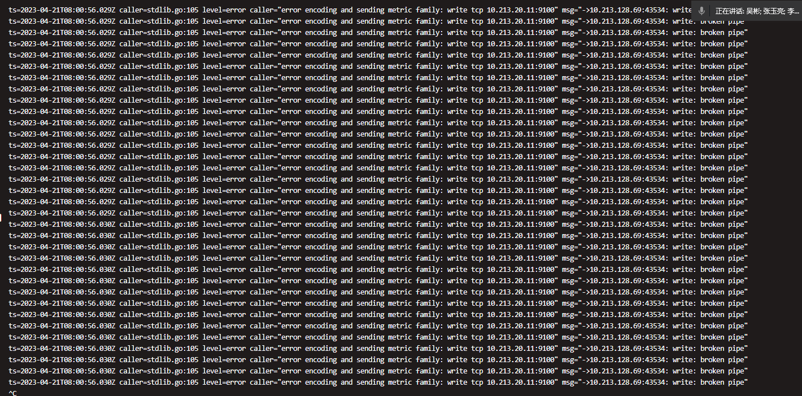

---
kind:
  - Troubleshooting
products:
  - Alauda Container Platform
  - Alauda DevOps
  - Alauda AI
  - Alauda Application Services
  - Alauda Service Mesh
  - Alauda Developer Portal
ProductsVersion:
  - 4.1.0,4.2.x
---
<!-- A type of document that involves encountering a fault, diagnosing it, performing root cause analysis, and providing solutions. -->

# 3.10.1

集群部分节点监控无数据

## Cause
- node-exporter锁导致卡住，无法正常收集监控数据

## Resolution
- 修改kube-prometheus-exporter-node添加参数: name: GOMAXPROCS value: "1"

## [workaround]

## [Related Information]
**Screenshots**

- Environment: 3.10.1
- kube-prometheus-exporter-node
- GOMAXPROCS
- Component: (待归类)
- Page ID: 151879931
- Original Title: 3.10.1-基础架构-集群主机部分节点监控显示异常
