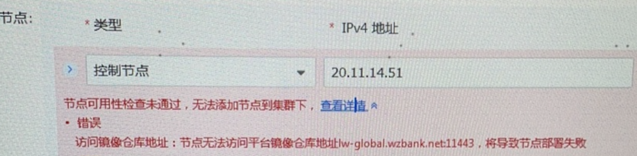

---
kind:
  - Troubleshooting
products:
  - Alauda Container Platform
  - Alauda DevOps
  - Alauda AI
  - Alauda Application Services
  - Alauda Service Mesh
  - Alauda Developer Portal
ProductsVersion:
  - 4.1.0,4.2.x
---
<!-- A type of document that involves encountering a fault, diagnosing it, performing root cause analysis, and providing solutions. -->

# 3.10.1

部署报错检查11443端口不通过

## Cause

## Resolution
- 在tke-platform-api部署中新增环境变量SKIP_CHECKERS=VALIDATE_REGISTRY_ADDR

## [workaround]

## [Related Information]
**Screenshots**

- Environment: 3.10.1
- 11443端口
- tke-platform-api
- cpaas-system
- VALIDATE_REGISTRY_ADDR
- SKIP_CHECKERS
- Component: (待归类)
- Page ID: 151879989
- Original Title: 3.10.1-部署报错检查11443端口不通过
