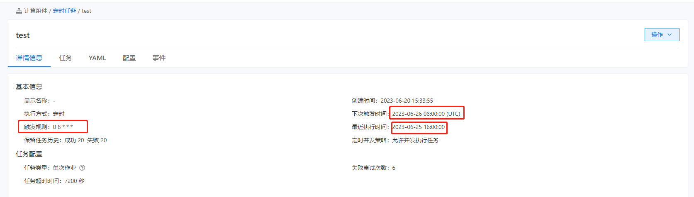

---
kind:
  - Troubleshooting
products:
  - Alauda Container Platform
  - Alauda DevOps
  - Alauda AI
  - Alauda Application Services
  - Alauda Service Mesh
  - Alauda Developer Portal
ProductsVersion:
  - 4.1.0,4.2.x
---
<!-- A type of document that involves encountering a fault, diagnosing it, performing root cause analysis, and providing solutions. -->

# <计算组件>定时任务触发规则时间异常

定时任务规则时间（UTC）与平台呈现时间不符

## Cause
- 平台未正确处理UTC时间与本地时间的时区转换

## Resolution
- 升级到3.8.3版本，该版本已修正时区处理逻辑

## [workaround]
- 手动计算UTC时间与本地时间偏移量（如UTC+8），按实际需求设置触发规则

## [Related Information]
**Screenshots**

- Environment: ACP3.6.2
- 定时任务触发规则配置
- 时区配置参数
- Component: (待归类)
- Page ID: 151885707
- Original Title: <计算组件>定时任务触发规则时间异常
