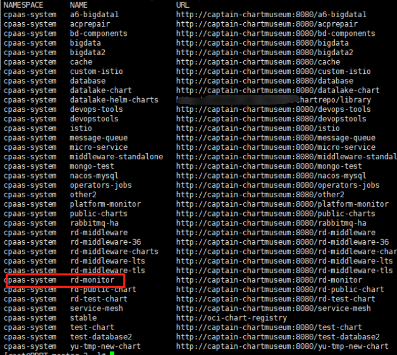
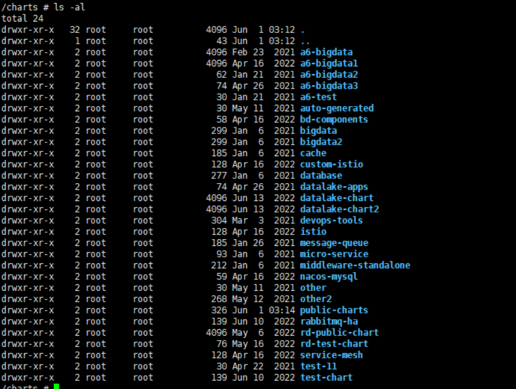
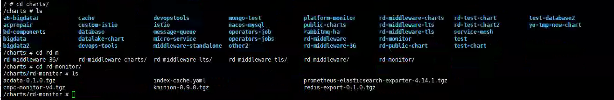

---
kind:
  - Troubleshooting
products:
  - Alauda Container Platform
  - Alauda DevOps
  - Alauda AI
  - Alauda Application Services
  - Alauda Service Mesh
  - Alauda Developer Portal
ProductsVersion:
  - 4.1.0,4.2.x
---
<!-- A type of document that involves encountering a fault, diagnosing it, performing root cause analysis, and providing solutions. -->

# 3.6.2

git中删除模板后同步仍显示 删除Global集群中的charts资源后，模板被重新同步回来

## Cause
- chartmuseum存在残留的tgz包和index-cache.yaml文件
- charts资源未完全清理导致重新同步

## Resolution
- 删除/cpaas/captain-chartmuseum/下对应模板仓库的tgz包和index-cache.yaml
- 删除同名charts资源
- 重启global集群cpaas-system命名空间下captain-controller-manager和captain-chartmuseum的pod
- 重新同步模板仓库

## [workaround]

## [Related Information]
**Screenshots**

- Environment: 3.6.2
- /cpaas/captain-chartmuseum/
- index-cache.yaml
- charts资源
- captain-controller-manager
- captain-chartmuseum
- 模板仓库名称
- Component: (待归类)
- Page ID: 152633974
- Original Title: 3.6.2-容器平台-模版仓库内的应用模版在git库被删除后还可以同步显示
