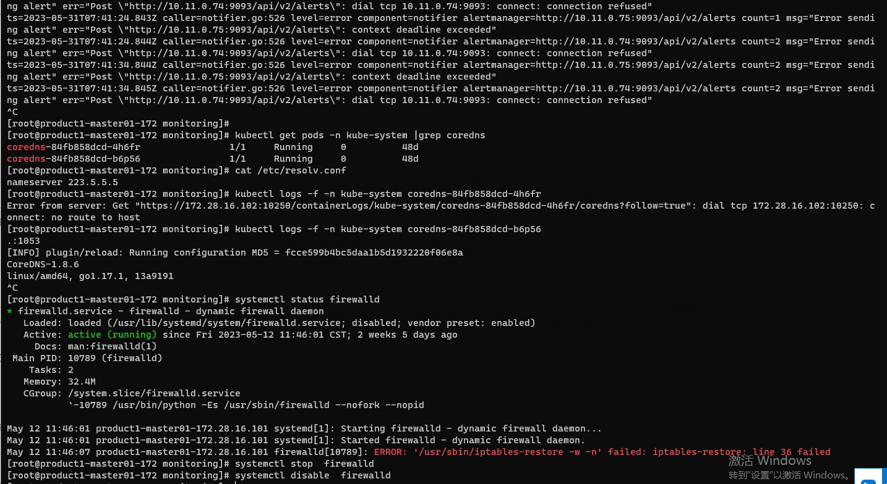

---
kind:
  - Troubleshooting
products:
  - Alauda Container Platform
  - Alauda DevOps
  - Alauda AI
  - Alauda Application Services
  - Alauda Service Mesh
  - Alauda Developer Portal
ProductsVersion:
  - 4.1.0,4.2.x
---
<!-- A type of document that involves encountering a fault, diagnosing it, performing root cause analysis, and providing solutions. -->

# 3.10.2

监控组件日志内报错连接服务超时或者被拒绝

## Cause
- 防火墙开启导致网络连接异常

## Resolution
- 关闭防火墙

## [workaround]

## [Related Information]
**Screenshots**

- Environment: 3.10.2
- 防火墙配置
- Component: (待归类)
- Page ID: 152633977
- Original Title: 3.10.2-基础架构-业务集群监控组件异常
