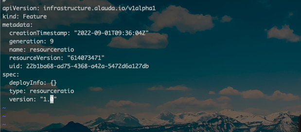

---
kind:
  - Troubleshooting
products:
  - Alauda Container Platform
  - Alauda DevOps
  - Alauda AI
  - Alauda Application Services
  - Alauda Service Mesh
  - Alauda Developer Portal
ProductsVersion:
  - 4.1.0,4.2.x
---
<!-- A type of document that involves encountering a fault, diagnosing it, performing root cause analysis, and providing solutions. -->

# pod和deploy的资源不一致

pod的资源声明（2c4g）与deployment的request.cpu:100m、memory:100m不一致

## Cause
- metis组件可能覆盖了资源配比设置

## Resolution
- 修改kubectl get features resourceratio配置项

## [workaround]
- 关闭metis的pod后执行delete pod操作

## [Related Information]
**Screenshots**

- Environment: 3.10.1
- metis
- resourceratio
- deployment
- replicaset
- request.cpu
- request.memory
- Component: (待归类)
- Page ID: 152653525
- Original Title: 容器平台-pod和deploy的资源不一致
