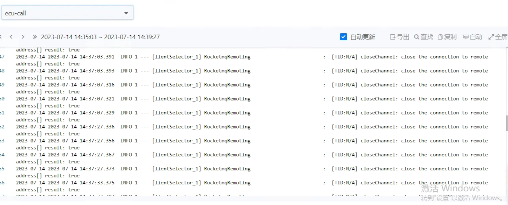

---
kind:
  - Troubleshooting
products:
  - Alauda Container Platform
  - Alauda DevOps
  - Alauda AI
  - Alauda Application Services
  - Alauda Service Mesh
  - Alauda Developer Portal
ProductsVersion:
  - 4.1.0,4.2.x
---
<!-- A type of document that involves encountering a fault, diagnosing it, performing root cause analysis, and providing solutions. -->

# 日志采集偶现采集不完整

日志采集偶现不完整 查询时行数缺失甚至无记录

## Cause
- 容器启动/退出触发nevermore日志采集进程重启
- 节点pod数量过多

## Resolution
- 确认该问题为TKE 3.10版本缺陷，需升级版本修复

## [workaround]

## [Related Information]
**Screenshots**

- Environment: TKE 3.10
- nevermore
- 文件日志配置
- 容器生命周期事件
- Component: (待归类)
- Page ID: 152657661
- Original Title: 日志采集偶现采集不完整
