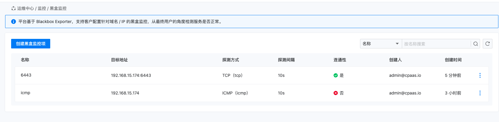
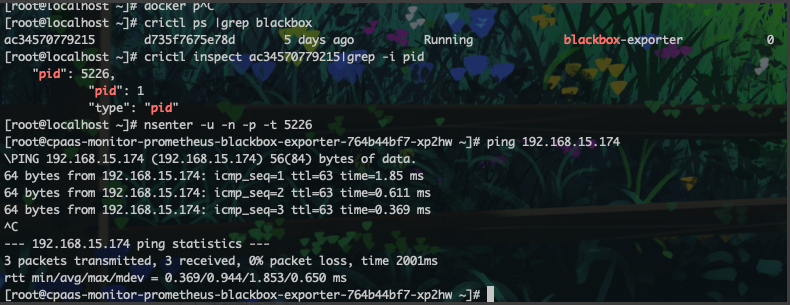

---
kind:
  - Troubleshooting
products:
  - Alauda Container Platform
  - Alauda DevOps
  - Alauda AI
  - Alauda Application Services
  - Alauda Service Mesh
  - Alauda Developer Portal
ProductsVersion:
  - 4.1.0,4.2.x
---
<!-- A type of document that involves encountering a fault, diagnosing it, performing root cause analysis, and providing solutions. -->

# 黑盒监控icmp失败

icmp探测容器ip、节点ip都不通 blackbox pod内可ping通被探测方 tcp探测节点ip:6443正常

## Cause
- 产品bug

## Resolution
- 升级到TKE 3.12.2版本修复

## [workaround]

## [Related Information]
**Screenshots**

- Environment: TKE 3.12
- 黑盒监控
- icmp探测
- 节点ip
- 6443端口
- Component: (待归类)
- Page ID: 152657816
- Original Title: 黑盒监控icmp失败
