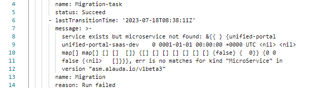

---
kind:
  - Troubleshooting
products:
  - Alauda Container Platform
  - Alauda DevOps
  - Alauda AI
  - Alauda Application Services
  - Alauda Service Mesh
  - Alauda Developer Portal
ProductsVersion:
  - 4.1.0,4.2.x
---
<!-- A type of document that involves encountering a fault, diagnosing it, performing root cause analysis, and providing solutions. -->

# 删除服务网格不成功

页面删除服务网格失败 后台手动删除后仍部署不成功 页面持续显示删除中状态

## Cause
- 残留的finalizer阻止资源删除
- service资源存在asm标签残留

## Resolution
- 删除service中的asm标签后重新部署

## [workaround]
- 手动清理istio-system命名空间资源：kubectl -n istio-system delete csv/sub/deploy --all

## [Related Information]
**Screenshots**

- Environment: Global集群及业务集群的istio-system命名空间
- asms
- jaeger
- flagger
- istio-system
- csv
- sub
- deploy
- servicemesh
- servicemeshgroup
- Component: (待归类)
- Page ID: 152658411
- Original Title: 删除服务网格不成功
