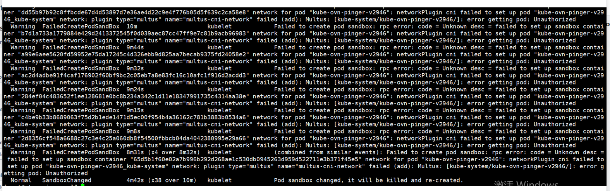

---
kind:
  - Troubleshooting
products:
  - Alauda Container Platform
  - Alauda DevOps
  - Alauda AI
  - Alauda Application Services
  - Alauda Service Mesh
  - Alauda Developer Portal
ProductsVersion:
  - 4.1.0,4.2.x
---
<!-- A type of document that involves encountering a fault, diagnosing it, performing root cause analysis, and providing solutions. -->

# ovn

ovn-pinger异常无法启动 报错network：plugin type="multus" name="multus-cni-network' failed

## Cause
- 存在冲突的CNI配置（00-kube-ovn.conflist文件与multus.d目录）

## Resolution
- cd /etc/cni/net.d/
- 删除00-kube-ovn.conflist文件和multus.d目录
- 重建multus服务

## [workaround]

## [Related Information]
**Screenshots**

- /etc/cni/net.d/
- 00-kube-ovn.conflist
- multus.d
- multus-cni-network
- Component: (待归类)
- Page ID: 152659506
- Original Title: ovn-pinger异常
