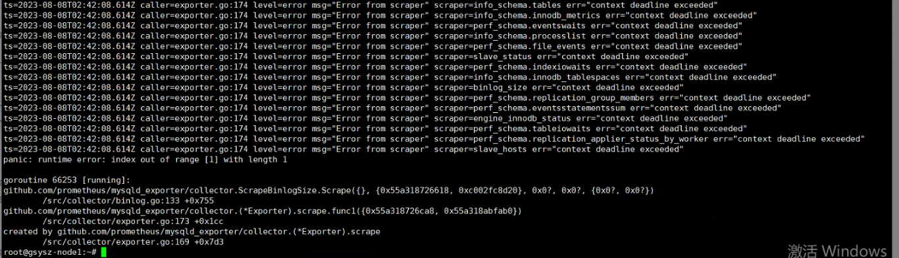
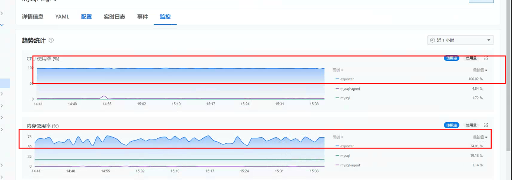
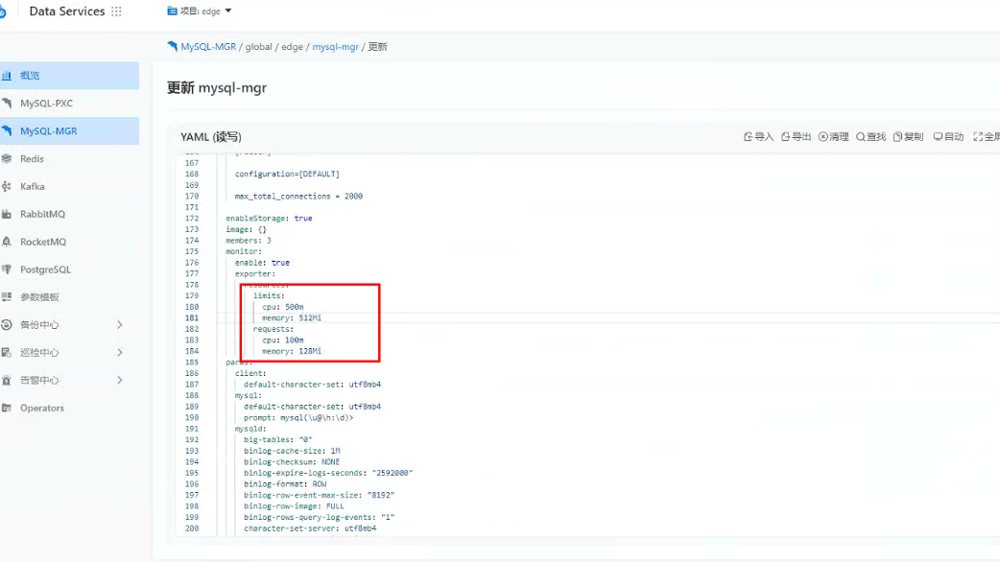

---
kind:
  - Troubleshooting
products:
  - Alauda Container Platform
  - Alauda DevOps
  - Alauda AI
  - Alauda Application Services
  - Alauda Service Mesh
  - Alauda Developer Portal
ProductsVersion:
  - 4.1.0,4.2.x
---
<!-- A type of document that involves encountering a fault, diagnosing it, performing root cause analysis, and providing solutions. -->

# 3.12.1

mgr-exporter容器频繁重启 CPU使用率达到100%

## Cause
- 监控组件资源不足导致CPU资源耗尽

## Resolution
- 通过数据服务界面修改对应实例的yaml资源配置，适当增加资源限制

## [workaround]

## [Related Information]
**Screenshots**

- Environment: 3.12.1
- mgr-exporter
- mysql-mgr
- 资源限制配置项
- Component: (待归类)
- Page ID: 155332673
- Original Title: 3.12.1-mysql-mgr实例中mgr-exporter容器频繁重启
