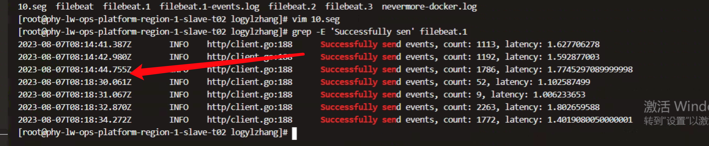
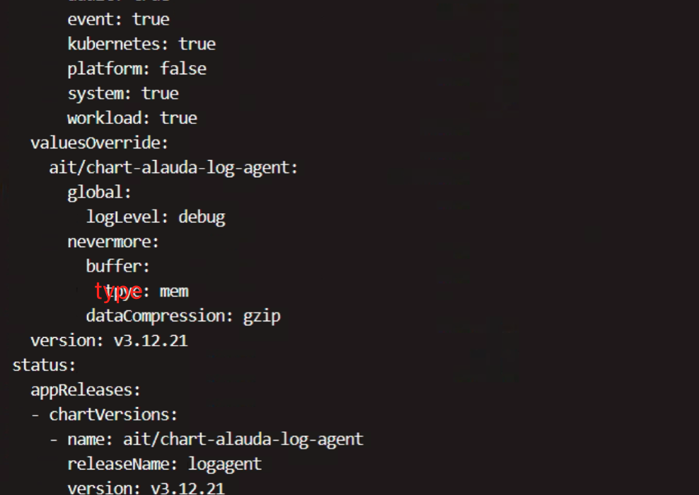
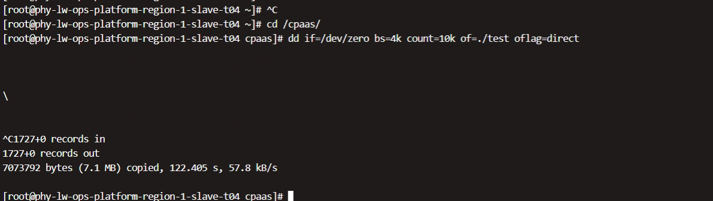

---
kind:
  - Troubleshooting
products:
  - Alauda Container Platform
  - Alauda DevOps
  - Alauda AI
  - Alauda Application Services
  - Alauda Service Mesh
  - Alauda Developer Portal
ProductsVersion:
  - 4.1.0,4.2.x
---
<!-- A type of document that involves encountering a fault, diagnosing it, performing root cause analysis, and providing solutions. -->

# 某个应用的日志有延迟

个别应用日志延迟1-2小时 同一节点的应用出现延迟 nevermore日志采集数据间隔大

## Cause
- 磁盘I/O性能低下导致nevermore采集日志缓慢

## Resolution
- 更换磁盘
- 在global业务集群的nevermore配置中删除buffer.type字段恢复默认配置

## [workaround]
- 调整minfo配置将buffer.type改为memory绕过磁盘缓冲

## [Related Information]
**Screenshots**

- Environment: v3.10.1
- nevermore
- buffer.type
- minfo配置
- 磁盘I/O
- Component: (待归类)
- Page ID: 155332679
- Original Title: 基础架构-某个应用的日志有延迟
