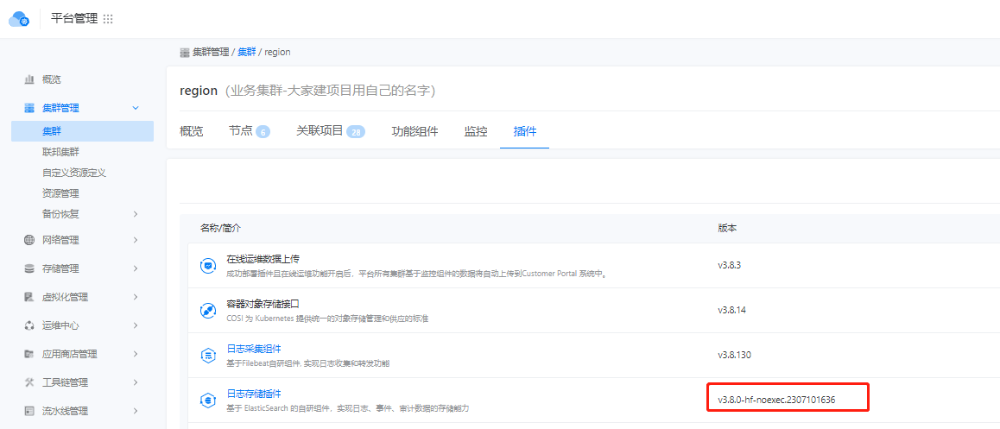
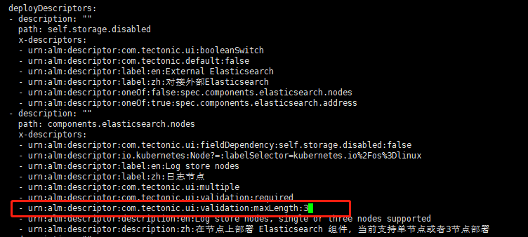
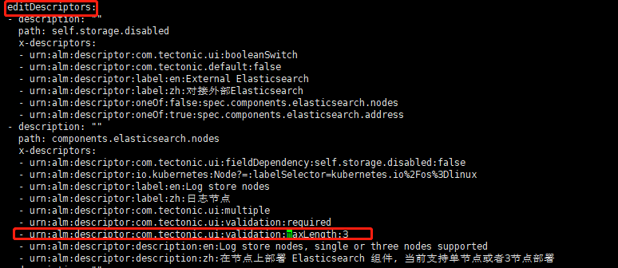

---
kind:
  - Troubleshooting
products:
  - Alauda Container Platform
  - Alauda DevOps
  - Alauda AI
  - Alauda Application Services
  - Alauda Service Mesh
  - Alauda Developer Portal
ProductsVersion:
  - 4.1.0,4.2.x
---
<!-- A type of document that involves encountering a fault, diagnosing it, performing root cause analysis, and providing solutions. -->

# 3.8 es 横向扩容

es性能瓶颈

## Cause
- components.elasticsearch.nodes.deploydescriptors和editdescriptors下的maxlength参数默认值3限制节点数量

## Resolution
- 修改moduleconfigs.cluster.alauda.io logcenter-v3.8.0-hf-noexec.2307101636中components.elasticsearch.nodes.deploydescriptors和editdescriptors的maxlength参数至5
- 通过平台es插件增加节点

## [workaround]

## [Related Information]
**Screenshots**

- Environment: 3.8
- components.elasticsearch.nodes
- moduleconfigs.cluster.alauda.io
- logcenter-v3.8.0-hf-noexec.2307101636
- deploydescriptors.maxlength
- editdescriptors.maxlength
- Component: (待归类)
- Page ID: 158335135
- Original Title: 3.8 es 横向扩容
