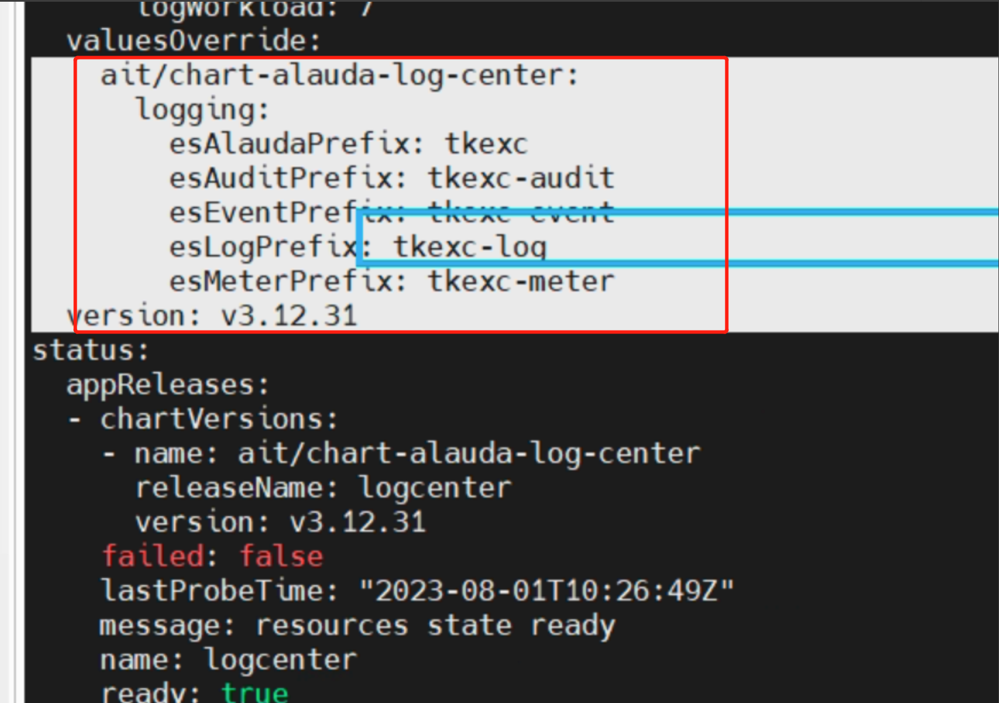

---
kind:
  - Troubleshooting
products:
  - Alauda Container Platform
  - Alauda DevOps
  - Alauda AI
  - Alauda Application Services
  - Alauda Service Mesh
  - Alauda Developer Portal
ProductsVersion:
  - 4.1.0,4.2.x
---
<!-- A type of document that involves encountering a fault, diagnosing it, performing root cause analysis, and providing solutions. -->

# 3.12

JIRA Jira：

## Cause

## Resolution
- kubectl get minfo -A | grep logcenter
- kubectl edit minfo global-e671599464a5b1717732c5ba36079795
- 在spec.valuesOverride.ait/chart-alauda-log-center.logging下添加esAlaudaPrefix/tke、esLogPrefix/tke-log、esEventPrefix/tke-event、esAuditPrefix/tke-audit、esMeterPrefix/tke-meter配置

## [workaround]

## [Related Information]
**Screenshots**

- Environment: 对接es，索引前缀
- minfo
- logcenter
- esAlaudaPrefix
- esLogPrefix
- esEventPrefix
- esAuditPrefix
- esMeterPrefix
- ait/chart-alauda-log-center
- Component: (待归类)
- Page ID: 161385292
- Original Title: 3.12-更改对接es内的索引前缀方案
