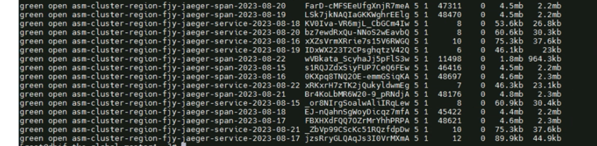

---
kind:
  - Troubleshooting
products:
  - Alauda Container Platform
  - Alauda DevOps
  - Alauda AI
  - Alauda Application Services
  - Alauda Service Mesh
  - Alauda Developer Portal
ProductsVersion:
  - 4.1.0,4.2.x
---
<!-- A type of document that involves encountering a fault, diagnosing it, performing root cause analysis, and providing solutions. -->

# 3.12

JIRA Jira：

## Cause

## Resolution
- 在 global 集群更新 servicemeshgroup 的 spec.meshCommonConfig.jaeger.indexPrefix 配置
- 执行验证命令：kubectl get asm asm -oyaml |grep indexprefix -B 1
- 执行验证命令：kubectl get jaeger -n istio-system jaeger-prod -oyaml|grep es.index-prefix
- 确认 jaeger 的 query 和 collector pod 已重启

## [workaround]

## [Related Information]
**Screenshots**

- Environment: 3.12
- servicemeshgroup
- asm
- jaeger
- spec.meshCommonConfig.jaeger.indexPrefix
- cpaas-system
- istio-system
- Component: (待归类)
- Page ID: 161385317
- Original Title: 3.12-更改对接es中的asm索引前缀
