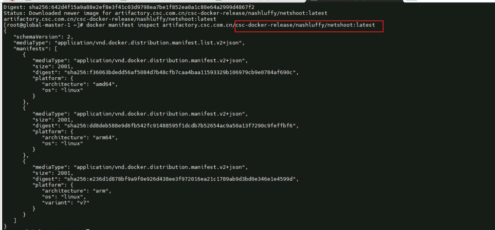
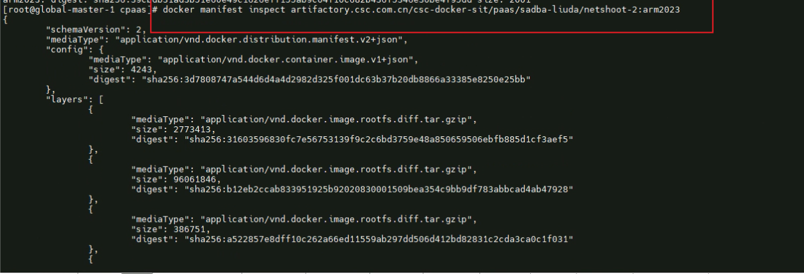

---
kind:
  - Troubleshooting
products:
  - Alauda Container Platform
  - Alauda DevOps
  - Alauda AI
  - Alauda Application Services
  - Alauda Service Mesh
  - Alauda Developer Portal
ProductsVersion:
  - 4.1.0,4.2.x
---
<!-- A type of document that involves encountering a fault, diagnosing it, performing root cause analysis, and providing solutions. -->

# 通过多架构镜像文件进行tag命名后，新tag镜像无法使用

新tag镜像无法使用

## Cause
- ARM环境下更改tag导致架构/操作系统/依赖项不兼容
- 镜像损坏

## Resolution
- 使用支持多架构的构建工具重新构建镜像
- 确保tag操作保留原始manifest信息

## [workaround]

## [Related Information]
**Screenshots**

- Environment: 通用
- manifest信息
- 多架构镜像
- tag操作
- 镜像构建工具
- Component: (待归类)
- Page ID: 163067631
- Original Title: 通过多架构镜像文件进行tag命名后，新tag镜像无法使用
