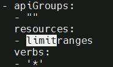

---
kind:
  - Troubleshooting
products:
  - Alauda Container Platform
  - Alauda DevOps
  - Alauda AI
  - Alauda Application Services
  - Alauda Service Mesh
  - Alauda Developer Portal
ProductsVersion:
  - 4.1.0,4.2.x
---
<!-- A type of document that involves encountering a fault, diagnosing it, performing root cause analysis, and providing solutions. -->

# 如何禁用项目管理员和命名空间管理员“更新容器限额”的权限

环境信息 适用版本：3.6

## Cause
- 项目管理员和命名空间管理员默认拥有更新容器限额（limitranges）的权限

## Resolution
- 修改 global 集群的 acp-project-admin ClusterRole
- 1. 执行 `kubectl get clusterrole -A | grep project` 查找角色
- 2. 编辑 acp-project-admin 的 YAML 配置
- 3. 在 rules 中删除 limitranges 资源的 update 权限
- 4. 生成 rpch 使配置生效

## [workaround]

## [Related Information]
**Screenshots**

- Environment: 3.6
- acp-project-admin
- ClusterRole
- limitranges
- rpch
- Component: (待归类)
- Page ID: 163078279
- Original Title: 如何禁用项目管理员和命名空间管理员“更新容器限额”的权限
