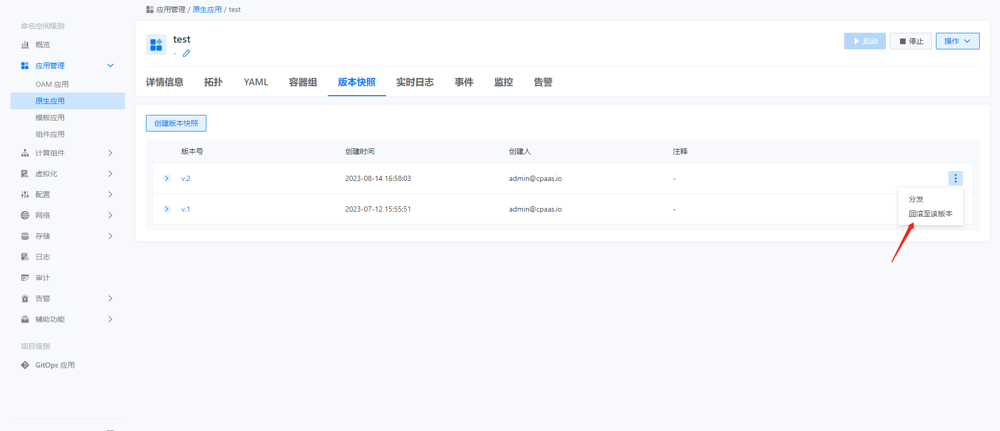

---
kind:
  - Troubleshooting
products:
  - Alauda Container Platform
  - Alauda DevOps
  - Alauda AI
  - Alauda Application Services
  - Alauda Service Mesh
  - Alauda Developer Portal
ProductsVersion:
  - 4.1.0,4.2.x
---
<!-- A type of document that involves encountering a fault, diagnosing it, performing root cause analysis, and providing solutions. -->

# 原生应用恢复旧版本yaml内容

原生应用的YAML被清空 需要回退至更新前的YAML版本

## Cause

## Resolution
- 通过容器平台→原生应用→版本快照功能回退至之前版本

## [workaround]

## [Related Information]
**Screenshots**

- Environment: 3.12.2
- 原生应用
- 版本快照
- Component: (待归类)
- Page ID: 164996941
- Original Title: 原生应用恢复旧版本yaml内容
